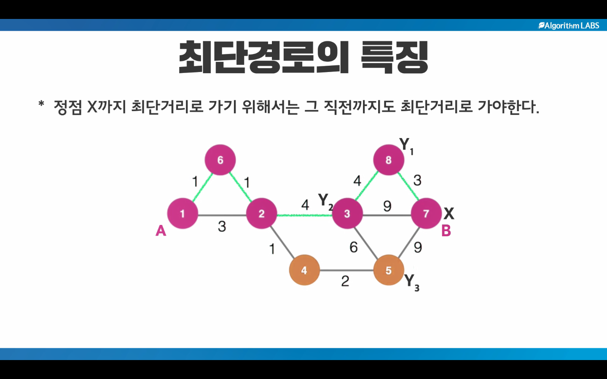

최단경로 알고리즘
=============
# 특징
## 정점 X까지의 최단거리로 가기 위해서는 그 직전까지도 최단거리로 가야한다.

1.다익스트라 알고리즘
--------------------
 # 하나의 정점에서 모든 정점까지 최단거리를 구하는 알고리즘 (간선의 가중치가 양수일 떄만)
## 서울을 기준으로 모든 도시까지의 거리 (1대N)

2.플로이드 알고리즘
--------------------
# 모든 정점에서 모든 정점까지 최단거리를 구하는 알고리즘
## 대한민국안의 모든 도시들간의 최단거리 (N대N)

3.벨만포드 알고리즘
-------------------
# 하나의 정점에서 모든 정점까지 최단거리를 구하는 알고리즘
## 간선의 가중치가 음수일 떄도 동작하는 다익스트라알고리즘의 확장판

![Kayak][logo]

[logo]: http://www.gstatic.com/webp/gallery/2.jpg "To go kayaking."
